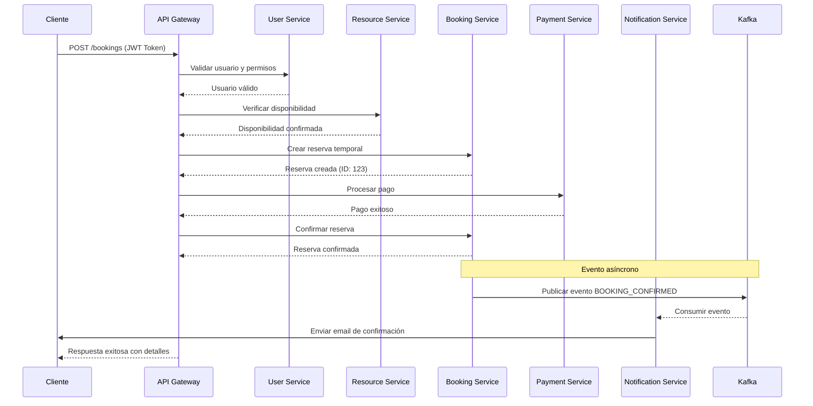
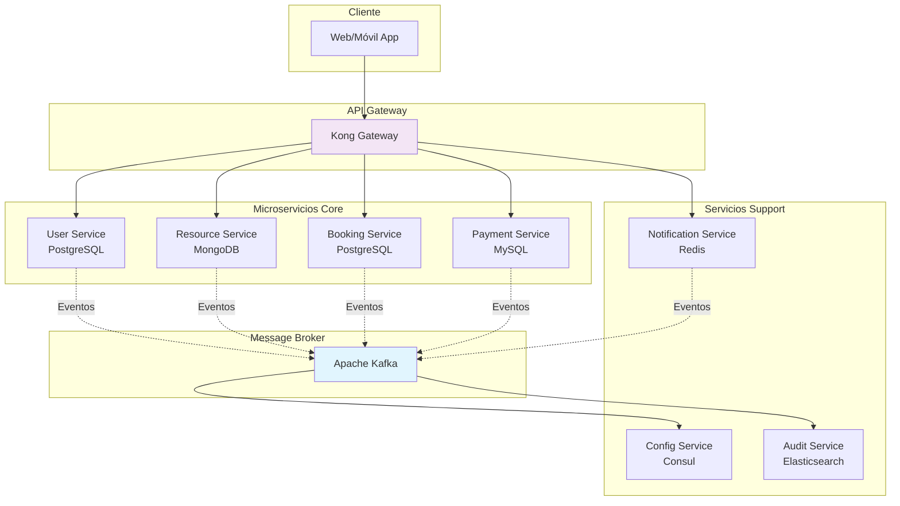

# Arquitectura de Microservicios para Sistema de Gestión de Espacios de Coworking

## Resumen Ejecutivo

Este documento presenta una arquitectura completa de microservicios diseñada para escalar la aplicación actual de reservas de salas hacia un sistema robusto de gestión de espacios de coworking. El diseño considera aspectos funcionales, no funcionales y tecnológicos, con enfoque en modularidad, independencia y facilidad de mantenimiento.

**Estado:** Diseño Arquitectónico Completo
**Versión:** 1.0.0
**Fecha:** Octubre 2025
**Infraestructura Target:** AWS

---

## 1. Requisitos de la Aplicación (Dominios de Negocio)

### 1.1 Dominios Principales

#### **Gestión de Usuarios**
- **Funcionalidades específicas:**
  - Autenticación segura con JWT y refresh tokens
  - Soporte para SSO (Google, redes sociales)
  - Gestión granular de roles: Administrador (acceso total), Miembro (reservas y pagos), Invitado (acceso limitado)
  - Registro con verificación de email y recuperación de contraseñas
  - Perfiles personalizables con preferencias de notificación
- **Entidades:** Usuario, Rol, Sesión, Preferencia
- **Integraciones externas:** Google OAuth, Facebook Login, servicios de email

#### **Gestión de Espacios/Recursos**
- **Funcionalidades específicas:**
  - Inventario dinámico de recursos físicos y virtuales
  - Gestión de oficinas privadas, escritorios compartidos, salas de reuniones
  - Atributos avanzados: capacidad, ubicación, disponibilidad horaria, precios dinámicos
  - Recursos adicionales: proyectores, pizarras, estaciones de carga
  - Categorización y búsqueda avanzada
- **Entidades:** Espacio, Recurso, Ubicación, Categoría, Precio
- **Integraciones externas:** Sistemas IoT para monitoreo de ocupación

#### **Reservas/Disponibilidad**
- **Funcionalidades específicas:**
  - Sistema de reservas en tiempo real con algoritmos de optimización
  - Calendarios interactivos con detección de conflictos
  - Políticas de cancelación y confirmaciones automáticas
  - Lista de espera y sugerencias alternativas
  - Gestión de recurrencia y reservas en bloque
- **Entidades:** Reserva, Disponibilidad, Conflicto, Política
- **Integraciones externas:** Calendarios externos (Google Calendar, Outlook)

#### **Facturación y Pagos**
- **Funcionalidades específicas:**
  - Generación automática de facturas detalladas
  - Procesamiento seguro con Stripe/PayPal
  - Planes de membresía con renovaciones automáticas
  - Gestión de descuentos, reembolsos y disputas
  - Reportes financieros y análisis de ingresos
- **Entidades:** Factura, Pago, Membresía, Descuento, Transacción
- **Integraciones externas:** Stripe, PayPal, sistemas contables

#### **Comunidad/Notificaciones**
- **Funcionalidades específicas:**
  - Módulo de noticias internas y eventos comunitarios
  - Foros de discusión y networking
  - Sistema push/email con personalización
  - Recordatorios automáticos y notificaciones en tiempo real
  - Encuestas y feedback de usuarios
- **Entidades:** Notificación, Evento, Foro, Mensaje
- **Integraciones externas:** Servicios de email, push notifications

### 1.2 Justificación de la Separación en Microservicios

Aplicando principios de **Domain-Driven Design (DDD)** y **bounded contexts**:

1. **Independencia de Desarrollo:** Cada servicio evoluciona sin afectar otros
2. **Escalabilidad Diferencial:** Servicios con mayor demanda escalan independientemente
3. **Especialización Tecnológica:** Cada dominio usa tecnología más adecuada
4. **Mantenimiento Simplificado:** Equipos especializados por dominio
5. **Tolerancia a Fallos:** Fallo en un servicio no afecta el sistema completo

---

## 2. Diseño de la Arquitectura de Microservicios

### 2.1 Arquitectura General

```
                    ┌─────────────────────────────────────────┐
                    │           CLIENTES WEB/MÓVIL           │
                    │   (Angular PWA, React Native)          │
                    └─────────────────┬───────────────────────┘
                                      │ HTTP/WebSocket
                                      ▼
                    ┌─────────────────────────────────────────┐
                    │            API GATEWAY                  │
                    │   (Kong Gateway en AWS API Gateway)    │
                    │   - Enrutamiento y Autenticación        │
                    │   - Rate Limiting y Caching            │
                    │   - Transformación de Protocolos       │
                    │   - Agregación de Respuestas           │
                    └─────────────────┬───────────────────────┘
                                      │
                    ┌─────────────────┼───────────────────────┐
                    │                 │                       │
          ┌─────────▼──────┐ ┌────────▼──────┐ ┌─────────▼──────┐
          │                │ │               │ │                │
    ┌─────▼────────────────┐ │ ┌─────────────┐ │ ┌─────────────┐  │
    │                      │ │ │             │ │ │             │  │
    │ SERVICIO DE USUARIOS │◄┼─┤SERVICIO DE  │◄┼─┤SERVICIO DE  │  │
    │                      │ │ │  RECURSOS   │ │ │ RESERVAS    │  │
    │ - Autenticación      │ │ │             │ │ │             │  │
    │ - Gestión de perfiles│ │ │ - Inventario│ │ │ - Calendario│  │
    └──────────────────────┘ │ └─────────────┘ │ └─────────────┘  │
                             │                 │                  │
    ┌─────────────────────────┼─────────────────┼──────────────────┘
    │                         │                 │
    ▼                         ▼                 ▼
┌──────┐  ┌──────┐  ┌──────┐  ┌──────┐  ┌──────┐  ┌──────┐
│Postgre│ │MongoDB│ │Postgre│ │MySQL  │ │Redis  │ │Elasti │
│SQL    │ │       │ │SQL    │ │       │ │       │ │Search │
│Users  │ │Recur- │ │Reser- │ │Pagos  │ │Notifi-│ │Logs   │
│       │ │sos    │ │vas    │ │       │ │cations│ │       │
└──────┘  └──────┘  └──────┘  └──────┘  └──────┘  └──────┘
```

### 2.2 Servicios Principales

#### **1. Servicio de Usuarios (User Service)**
```typescript
@Controller('users')
@UseGuards(JwtAuthGuard)
export class UserController {
  constructor(private readonly userService: UserService) {}

  @Get('profile')
  async getProfile(@Req() req: RequestWithUser) {
    return this.userService.findById(req.user.id);
  }

  @Put('profile')
  async updateProfile(
    @Req() req: RequestWithUser,
    @Body() updateDto: UpdateUserDto
  ) {
    return this.userService.update(req.user.id, updateDto);
  }

  @Post('preferences')
  async updatePreferences(
    @Req() req: RequestWithUser,
    @Body() preferences: UserPreferencesDto
  ) {
    return this.userService.updatePreferences(req.user.id, preferences);
  }
}
```

**Responsabilidades:**
- Autenticación y autorización
- Gestión de perfiles y preferencias
- Administración de roles y permisos

**Endpoints principales:**
- `POST /auth/login` - Inicio de sesión
- `POST /auth/register` - Registro de usuario
- `POST /auth/refresh` - Renovación de token
- `GET /users/profile` - Obtener perfil
- `PUT /users/profile` - Actualizar perfil

#### **2. Servicio de Recursos (Resource Service)**
```typescript
@Controller('resources')
export class ResourceController {
  constructor(private readonly resourceService: ResourceService) {}

  @Get()
  async getResources(@Query() filters: ResourceFiltersDto) {
    return this.resourceService.findWithFilters(filters);
  }

  @Get(':id/availability')
  async getAvailability(
    @Param('id') id: string,
    @Query() dateRange: DateRangeDto
  ) {
    return this.resourceService.getAvailability(id, dateRange);
  }

  @Post()
  @UseGuards(AdminGuard)
  async createResource(@Body() createDto: CreateResourceDto) {
    return this.resourceService.create(createDto);
  }
}
```

**Responsabilidades:**
- Gestión de inventario de espacios
- Control de disponibilidad en tiempo real
- Categorización y búsqueda avanzada

**Endpoints principales:**
- `GET /resources` - Listar recursos con filtros
- `GET /resources/:id/availability` - Disponibilidad específica
- `POST /resources` - Crear nuevo recurso
- `PUT /resources/:id` - Actualizar recurso

#### **3. Servicio de Reservas (Booking Service)**
```typescript
@Controller('bookings')
@UseGuards(JwtAuthGuard)
export class BookingController {
  constructor(private readonly bookingService: BookingService) {}

  @Post()
  async createBooking(@Body() createDto: CreateBookingDto) {
    return this.bookingService.create(createDto);
  }

  @Get('calendar')
  async getCalendar(
    @Query() filters: CalendarFiltersDto
  ) {
    return this.bookingService.getCalendarView(filters);
  }

  @Patch(':id/status')
  @UseGuards(AdminGuard)
  async updateStatus(
    @Param('id') id: string,
    @Body() statusDto: UpdateBookingStatusDto
  ) {
    return this.bookingService.updateStatus(id, statusDto);
  }
}
```

**Responsabilidades:**
- Procesamiento de reservas
- Gestión de calendarios y conflictos
- Políticas de cancelación

**Endpoints principales:**
- `POST /bookings` - Crear nueva reserva
- `GET /bookings` - Listar reservas del usuario
- `GET /bookings/calendar` - Vista de calendario
- `PATCH /bookings/:id/status` - Cambiar estado

#### **4. Servicio de Pagos (Payment Service)**
```typescript
@Controller('payments')
@UseGuards(JwtAuthGuard)
export class PaymentController {
  constructor(private readonly paymentService: PaymentService) {}

  @Post('process')
  async processPayment(@Body() paymentDto: ProcessPaymentDto) {
    return this.paymentService.process(paymentDto);
  }

  @Get('invoices')
  async getInvoices(@Req() req: RequestWithUser) {
    return this.paymentService.getUserInvoices(req.user.id);
  }

  @Post('webhook')
  async handleWebhook(@Body() webhookDto: WebhookDto) {
    return this.paymentService.handleWebhook(webhookDto);
  }
}
```

**Responsabilidades:**
- Procesamiento seguro de pagos
- Generación de facturas
- Gestión de suscripciones

**Endpoints principales:**
- `POST /payments/process` - Procesar pago
- `GET /payments/invoices` - Obtener facturas
- `POST /payments/subscribe` - Crear suscripción

#### **5. Servicio de Notificaciones (Notification Service)**
```typescript
@Controller('notifications')
export class NotificationController {
  constructor(private readonly notificationService: NotificationService) {}

  @Get()
  @UseGuards(JwtAuthGuard)
  async getNotifications(@Req() req: RequestWithUser) {
    return this.notificationService.getUserNotifications(req.user.id);
  }

  @Post('preferences')
  @UseGuards(JwtAuthGuard)
  async updatePreferences(
    @Req() req: RequestWithUser,
    @Body() preferences: NotificationPreferencesDto
  ) {
    return this.notificationService.updatePreferences(req.user.id, preferences);
  }

  @Post('test')
  @UseGuards(AdminGuard)
  async sendTestNotification(@Body() testDto: TestNotificationDto) {
    return this.notificationService.sendTest(testDto);
  }
}
```

**Responsabilidades:**
- Sistema de notificaciones push/email
- Gestión de comunidad y eventos
- Personalización de comunicaciones

**Endpoints principales:**
- `GET /notifications` - Obtener notificaciones
- `POST /notifications/mark-read` - Marcar como leída
- `POST /community/events` - Crear evento comunitario

#### **6. Servicio de Configuración (Config Service)**
```typescript
@Controller('config')
@UseGuards(AdminGuard)
export class ConfigController {
  constructor(private readonly configService: ConfigService) {}

  @Get('features')
  async getFeatureFlags() {
    return this.configService.getFeatureFlags();
  }

  @Put('features/:key')
  async toggleFeature(
    @Param('key') key: string,
    @Body() toggleDto: FeatureToggleDto
  ) {
    return this.configService.toggleFeature(key, toggleDto);
  }

  @Get('settings')
  async getSettings() {
    return this.configService.getAllSettings();
  }
}
```

**Responsabilidades:**
- Gestión de configuraciones globales
- Feature flags para despliegues controlados
- Parámetros de sistema

#### **7. Servicio de Auditoría (Audit Service)**
```typescript
@Controller('audit')
@UseGuards(AdminGuard)
export class AuditController {
  constructor(private readonly auditService: AuditService) {}

  @Get('logs')
  async getLogs(@Query() filters: AuditFiltersDto) {
    return this.auditService.queryLogs(filters);
  }

  @Get('reports')
  async getReports(@Query() reportDto: ReportRequestDto) {
    return this.auditService.generateReport(reportDto);
  }

  @Post('export')
  async exportLogs(@Body() exportDto: ExportRequestDto) {
    return this.auditService.exportLogs(exportDto);
  }
}
```

**Responsabilidades:**
- Logging centralizado de todas las operaciones
- Generación de reportes de auditoría
- Cumplimiento normativo

### 2.3 API Gateway

**Tecnología:** Kong Gateway sobre AWS API Gateway

**Características implementadas:**
- **Enrutamiento inteligente:** Basado en versiones y autenticación
- **Rate limiting:** Por usuario/endpoint (1000 req/hora por usuario)
- **Caching:** Redis para respuestas frecuentes (TTL configurable)
- **Transformación:** Protocolos REST/gRPC automáticos
- **Agregación:** Reducción de llamadas al cliente
- **Versionado:** Soporte para deprecación gradual

**Ejemplo de configuración Kong:**
```yaml
# kong.yml
services:
  - name: user-service
    url: http://user-service:3000
    routes:
      - name: user-routes
        paths:
          - /v1/users
          - /v1/auth
        methods:
          - GET
          - POST
          - PUT
        plugins:
          - name: jwt
          - name: rate-limiting
            config:
              hour: 1000
              limit_by: consumer

plugins:
  - name: cors
  - name: request-transformer
  - name: response-transformer
```

### 2.4 Mecanismos de Comunicación

#### **Comunicación Síncrona (RESTful)**
```typescript
@Injectable()
export class ResourceClientService {
  constructor(private readonly httpClient: HttpClient) {}

  async checkAvailability(resourceId: string, dateTime: DateTimeRange): Promise<AvailabilityResponse> {
    return this.httpClient
      .get<AvailabilityResponse>(`/resources/${resourceId}/availability`, {
        params: {
          startDate: dateTime.startDate.toISOString(),
          endDate: dateTime.endDate.toISOString()
        }
      })
      .toPromise();
  }

  async getResourceDetails(resourceId: string): Promise<Resource> {
    return this.httpClient
      .get<Resource>(`/resources/${resourceId}`)
      .toPromise();
  }
}
```

#### **Comunicación Asíncrona (Event-Driven)**
```typescript
@Injectable()
export class BookingEventPublisher {
  constructor(
    @Inject('KAFKA_PRODUCER') private kafkaProducer: KafkaProducer
  ) {}

  async publishBookingConfirmed(booking: Booking): Promise<void> {
    await this.kafkaProducer.send({
      topic: 'booking-events',
      messages: [{
        key: booking.id,
        value: {
          eventType: 'BOOKING_CONFIRMED',
          eventData: {
            bookingId: booking.id,
            userId: booking.userId,
            resourceId: booking.resourceId,
            timestamp: new Date()
          }
        }
      }]
    });
  }

  async publishPaymentCompleted(payment: Payment): Promise<void> {
    await this.kafkaProducer.send({
      topic: 'payment-events',
      messages: [{
        key: payment.id,
        value: {
          eventType: 'PAYMENT_COMPLETED',
          eventData: {
            paymentId: payment.id,
            bookingId: payment.bookingId,
            amount: payment.amount,
            timestamp: new Date()
          }
        }
      }]
    });
  }
}
```

**Eventos principales definidos:**
- `user.created` → Trigger notificación bienvenida
- `booking.confirmed` → Trigger procesamiento pago y notificaciones
- `payment.completed` → Trigger actualización estado reserva
- `resource.updated` → Trigger recálculo disponibilidades

### 2.5 Patrón de Base de Datos

#### **Database per Service Pattern**

| Servicio | Tecnología | Justificación | Modelo |
|----------|------------|---------------|---------|
| **Usuarios** | PostgreSQL 14+ | Relaciones complejas, transacciones ACID | SQL relacional con índices avanzados |
| **Recursos** | MongoDB 6.0+ | Flexibilidad para inventario dinámico | Documentos JSON con búsquedas geoespaciales |
| **Reservas** | PostgreSQL 14+ | Transacciones complejas, integridad | SQL con particionamiento por fecha |
| **Pagos** | MySQL 8.0+ | Auditoría financiera estricta | SQL optimizado para operaciones monetarias |
| **Notificaciones** | Redis 7.0+ | Almacenamiento temporal, colas | Key-value con TTL automático |
| **Auditoría** | Elasticsearch 8.0+ | Búsqueda y análisis de logs | Documentos indexados con agregaciones |

#### **Estrategias de Consistencia**

**1. Event Sourcing para Auditoría:**
```typescript
@Entity('domain_events')
export class DomainEvent {
  @PrimaryGeneratedColumn('uuid')
  id: string;

  @Column()
  aggregateId: string;

  @Column()
  aggregateType: string;

  @Column()
  eventType: string;

  @Column({ type: 'jsonb' })
  eventData: Record<string, any>;

  @Column()
  version: number;

  @Column({ type: 'jsonb', nullable: true })
  metadata: Record<string, any>;

  @CreateDateColumn()
  createdAt: Date;

  @Column({ type: 'uuid' })
  correlationId: string;
}
```

**2. Saga Pattern para Transacciones Distribuidas:**
```typescript
@Injectable()
export class BookingSagaOrchestrator {
  constructor(
    private readonly bookingService: BookingService,
    private readonly paymentService: PaymentService,
    private readonly notificationService: NotificationService,
    private readonly sagaRepository: SagaRepository
  ) {}

  async execute(createBookingDto: CreateBookingDto): Promise<void> {
    const saga = await this.sagaRepository.create({
      type: 'CREATE_BOOKING',
      state: 'STARTED'
    });

    try {
      // Paso 1: Crear reserva temporal
      const booking = await this.bookingService.createTemporary(createBookingDto);
      await this.sagaRepository.updateStep(saga.id, 'BOOKING_CREATED', { bookingId: booking.id });

      // Paso 2: Procesar pago
      const payment = await this.paymentService.processPayment({
        bookingId: booking.id,
        amount: booking.totalAmount,
        ...createBookingDto.paymentInfo
      });
      await this.sagaRepository.updateStep(saga.id, 'PAYMENT_PROCESSED', { paymentId: payment.id });

      // Paso 3: Confirmar reserva
      await this.bookingService.confirm(booking.id);
      await this.sagaRepository.updateStep(saga.id, 'BOOKING_CONFIRMED');

      // Paso 4: Enviar notificaciones
      await this.notificationService.sendBookingConfirmation(booking.id);
      await this.sagaRepository.updateStep(saga.id, 'NOTIFICATIONS_SENT');

      await this.sagaRepository.complete(saga.id);

    } catch (error) {
      await this.sagaRepository.fail(saga.id, error);
      await this.compensate(saga.id, error);
    }
  }

  private async compensate(sagaId: string, error: Error): Promise<void> {
    const saga = await this.sagaRepository.findById(sagaId);

    for (const step of saga.completedSteps.reverse()) {
      switch (step.name) {
        case 'BOOKING_CREATED':
          await this.bookingService.cancel(step.data.bookingId);
          break;
        case 'PAYMENT_PROCESSED':
          await this.paymentService.refund(step.data.paymentId);
          break;
        case 'NOTIFICATIONS_SENT':
          // Las notificaciones no necesitan compensación
          break;
      }
    }
  }
}
```

---

## 3. Consideraciones Tecnológicas y No Funcionales

### 3.1 Stack Tecnológico Completo

#### **Backend (Microservicios)**
- **Framework Principal:** NestJS 10+ con TypeScript 5+
  - Arquitectura modular por microservicio
  - Decoradores para separación clara de responsabilidades
  - Integración nativa con múltiples protocolos
- **Comunicación:**
  - REST: Para operaciones síncronas con validación automática
  - GraphQL: Para consultas complejas (opcional)
  - gRPC: Para comunicación interna de alta performance
  - WebSockets: Para actualizaciones en tiempo real
- **ORM y Bases de Datos:**
  - TypeORM para servicios SQL (Usuarios, Reservas, Pagos)
  - Mongoose para MongoDB (Recursos)
  - Redis como cache y broker de mensajes

#### **Frontend**
- **Framework:** Angular 17+ con arquitectura standalone components
- **Estado:** NgRx para gestión predictible del estado
- **UI/UX:** Angular Material + Tailwind CSS
- **PWA:** Service Workers para funcionalidad offline
- **Comunicación:** Apollo Client para GraphQL

#### **DevOps y Herramientas**
- **Contenerización:** Docker con multi-stage builds
- **Orquestación:** Kubernetes con Helm charts
- **CI/CD:** GitHub Actions con workflows avanzados
- **Monitoreo:** ELK Stack + Prometheus + Grafana
- **Message Broker:** Apache Kafka para eventos
- **Service Mesh:** Istio para observabilidad

### 3.2 Orquestación y Despliegue (DevOps)

#### **Arquitectura de Infraestructura AWS**

```
                    ┌─────────────────────────────────────────┐
                    │           AWS CLOUD REGION              │
                    └─────────────────┬───────────────────────┘
                                      │
                    ┌─────────────────┼───────────────────────┐
                    │                 │                       │
          ┌─────────▼──────┐ ┌────────▼──────┐ ┌─────────▼──────┐
          │                │ │               │ │                │
    ┌─────▼────────────────┐ │ ┌─────────────┐ │ ┌─────────────┐  │
    │                      │ │ │             │ │ │             │  │
    │     EKS CLUSTER      │◄┼─┤   RDS       │◄┼─┤   ElastiCache│  │
    │                      │ │ │  PostgreSQL │ │ │    Redis     │  │
    │ - Auto-scaling       │ │ │             │ │ │              │  │
    │ - Health checks      │ │ │ - Read      │ │ │ - Caching    │  │
    │ - Rolling updates    │ │ │   replicas  │ │ │ - Sessions   │  │
    └──────────────────────┘ │ └─────────────┘ │ └─────────────┘  │
                             │                 │                  │
                    ┌────────┼─────────────────┼──────────────────┘
                    │        │                 │
                    ▼        ▼                 ▼
          ┌───────────────────┐ ┌──────────────┐ ┌─────────────────┐
          │                   │ │              │ │                 │
          │   S3 Storage      │ │   CloudFront │ │   Route 53      │
          │                   │ │     CDN      │ │   DNS           │
          │ - Assets estáticos│ │              │ │                 │
          │ - Backups         │ │ - Images     │ │ - Load balancer │
          │ - Logs            │ │ - Videos     │ │ - Failover      │
          └───────────────────┘ └──────────────┘ └─────────────────┘
```

#### **Pipeline CI/CD con GitHub Actions**

```yaml
# .github/workflows/deploy.yml
name: Microservices Deployment Pipeline
on:
  push:
    branches: [main, develop]
  pull_request:
    branches: [main]

env:
  AWS_REGION: us-east-1
  EKS_CLUSTER: coworking-cluster

jobs:
  test:
    runs-on: ubuntu-latest
    strategy:
      matrix:
        service: [user-service, resource-service, booking-service, payment-service, notification-service]

    steps:
      - uses: actions/checkout@v3

      - name: Setup Node.js
        uses: actions/setup-node@v3
        with:
          node-version: '18'
          cache: 'npm'
          cache-dependency-path: services/${{ matrix.service }}/package-lock.json

      - name: Install dependencies
        run: cd services/${{ matrix.service }} && npm ci

      - name: Run tests
        run: cd services/${{ matrix.service }} && npm run test:ci

      - name: Build Docker image
        run: |
          docker build -t ${{ matrix.service }}:${{ github.sha }} \
            -f services/${{ matrix.service }}/Dockerfile \
            services/${{ matrix.service }}

      - name: Push to ECR
        run: |
          aws ecr get-login-password --region $AWS_REGION | docker login --username AWS --password-stdin $ECR_REGISTRY
          docker tag ${{ matrix.service }}:${{ github.sha }} $ECR_REGISTRY/${{ matrix.service }}:${{ github.sha }}
          docker push $ECR_REGISTRY/${{ matrix.service }}:${{ github.sha }}

  deploy-staging:
    needs: test
    if: github.ref == 'refs/heads/develop'
    runs-on: ubuntu-latest

    steps:
      - name: Configure kubectl
        uses: aws-actions/configure-kubectl@v1
        with:
          cluster-name: ${{ env.EKS_CLUSTER }}
          aws-region: ${{ env.AWS_REGION }}

      - name: Deploy to staging
        run: |
          # Actualización blue-green
          kubectl set image deployment/${{ matrix.service }} ${{ matrix.service }}=$ECR_REGISTRY/${{ matrix.service }}:${{ github.sha }}
          kubectl rollout status deployment/${{ matrix.service }}
```

### 3.3 Escalabilidad y Observabilidad

#### **Estrategias de Escalabilidad**

**1. Auto-scaling Horizontal:**
```yaml
apiVersion: autoscaling/v2
kind: HorizontalPodAutoscaler
metadata:
  name: booking-service-hpa
spec:
  scaleTargetRef:
    apiVersion: apps/v1
    kind: Deployment
    name: booking-service
  minReplicas: 3
  maxReplicas: 20
  metrics:
  - type: Resource
    resource:
      name: cpu
      target:
        type: Utilization
        averageUtilization: 70
  - type: Resource
    resource:
      name: memory
      target:
        type: Utilization
        averageUtilization: 80
  behavior:
    scaleDown:
      stabilizationWindowSeconds: 300
      policies:
      - type: Percent
        value: 10
        periodSeconds: 60
```

**2. Database Scaling:**
- **Read Replicas:** Para consultas de solo lectura
- **Sharding:** Por ubicación geográfica para crecimiento masivo
- **Caching Strategy:** Redis multi-layer (aplicación, base de datos, CDN)

#### **Observabilidad Completa**

**1. Métricas con Prometheus:**
```yaml
global:
  scrape_interval: 15s

scrape_configs:
  - job_name: 'nestjs-services'
    static_configs:
      - targets: ['user-service:9090', 'booking-service:9090']
    metrics_path: '/metrics'
    scrape_interval: 10s
```

**2. Tracing Distribuido con Jaeger:**
```typescript
@Injectable()
export class TracingService {
  constructor(private readonly tracer: Tracer) {}

  startSpan(name: string, parentSpan?: Span): Span {
    const span = this.tracer.startSpan(name, {
      childOf: parentSpan,
      tags: {
        'service.name': 'booking-service',
        'span.kind': 'server'
      }
    });

    this.tracer.inject(span, 'http_headers', {});
    return span;
  }
}
```

**3. Logging Centralizado con ELK Stack:**
```typescript
const logger = winston.createLogger({
  level: 'info',
  format: winston.format.combine(
    winston.format.timestamp(),
    winston.format.errors({ stack: true }),
    winston.format.json()
  ),
  defaultMeta: { service: 'booking-service' },
  transports: [
    new winston.transports.Console(),
    new winston.Elasticsearch({
      level: 'info',
      index: 'coworking-logs',
      clientOpts: {
        node: process.env.ELASTICSEARCH_URL,
        auth: {
          username: process.env.ELASTICSEARCH_USER,
          password: process.env.ELASTICSEARCH_PASSWORD
        }
      }
    })
  ],
});
```

### 3.4 Diagramas Mermaid

#### **Flujo de Reserva Completo**



#### **Arquitectura de Comunicación**



---

## 4. Consideraciones de Seguridad

### 4.1 Autenticación y Autorización
- **JWT Strategy:** Tokens con rotación automática cada 15 minutos
- **RBAC:** Control granular de acceso basado en roles y recursos
- **SSO Integration:** Google OAuth 2.0 y redes sociales
- **MFA:** Autenticación de dos factores opcional

### 4.2 Seguridad de Datos
- **Encriptación:** AES-256 para datos sensibles en reposo
- **TLS:** Comunicación encriptada entre todos los servicios
- **mTLS:** Autenticación mutua entre servicios internos
- **Secrets Management:** AWS Secrets Manager para credenciales

### 4.3 Cumplimiento Normativo
- **GDPR:** Gestión de consentimiento y derecho al olvido
- **PCI DSS:** Cumplimiento para procesamiento de pagos
- **ISO 27001:** Prácticas de seguridad de información

---

## 5. Estrategia de Resiliencia

### 5.1 Circuit Breaker Pattern
```typescript
@Injectable()
export class PaymentServiceClient {
  constructor(private readonly httpClient: HttpClient) {}

  @CircuitBreaker({
    threshold: 5,
    timeout: 10000,
    resetTimeout: 30000
  })
  async processPayment(paymentDto: ProcessPaymentDto): Promise<PaymentResult> {
    return this.httpClient
      .post<PaymentResult>('/payments/process', paymentDto)
      .toPromise();
  }
}
```

### 5.2 Health Checks y Monitoring
```typescript
@Controller('health')
export class HealthController {
  constructor(
    private readonly health: HealthCheckService,
    private readonly db: TypeOrmHealthIndicator,
    private readonly memory: MemoryHealthIndicator,
    private readonly disk: DiskHealthIndicator
  ) {}

  @Get()
  @HealthCheck()
  check() {
    return this.health.check([
      () => this.db.pingCheck('database'),
      () => this.memory.checkHeap('memory_heap', 150 * 1024 * 1024),
      () => this.disk.checkStorage('storage', { path: '/', thresholdPercent: 0.9 })
    ]);
  }
}
```

### 5.3 Backup y Disaster Recovery
- **Backups automatizados:** Diarios con retención de 30 días
- **Cross-region replication:** Para alta disponibilidad
- **Point-in-time recovery:** Restauración a cualquier momento

---

## 6. Mantenimiento y Operaciones

### 6.1 Documentación
- **OpenAPI 3.0:** Especificación completa de todas las APIs
- **Arquitectura Decision Records:** Registro de decisiones técnicas
- **Runbooks:** Procedimientos para operaciones comunes

### 6.2 Testing Strategy
- **Unit Tests:** > 80% cobertura por servicio
- **Integration Tests:** Entre servicios relacionados
- **E2E Tests:** Flujos completos de usuario
- **Performance Tests:** Bajo carga simulada

### 6.3 Code Quality
- **Linting:** ESLint con reglas estrictas
- **Formatting:** Prettier con configuración unificada
- **Static Analysis:** SonarQube para detección de issues
- **Security Scanning:** SAST y DAST integrados en CI/CD

---

## 7. Métricas de Éxito

### 7.1 KPIs Técnicos
- **Disponibilidad:** > 99.5% uptime mensual
- **Tiempo de respuesta:** < 200ms para operaciones críticas
- **Throughput:** Capacidad para 10,000 reservas/día
- **Error rate:** < 0.1% para operaciones críticas

### 7.2 KPIs de Negocio
- **Tiempo de despliegue:** < 15 minutos por servicio
- **MTTR:** < 30 minutos para incidentes críticos
- **Cobertura de testing:** > 85% en todos los servicios
- **Adopción de usuarios:** > 95% de funcionalidades utilizadas

---

## 8. Roadmap de Implementación

### 8.1 Fase 1: Foundation (Meses 1-2)
- [ ] Configurar infraestructura AWS base
- [ ] Implementar servicios core (Usuarios, Recursos)
- [ ] Establecer API Gateway y comunicación básica
- [ ] Desplegar monitoreo básico

### 8.2 Fase 2: Core Features (Meses 3-4)
- [ ] Implementar servicio de Reservas completo
- [ ] Integrar servicio de Pagos con Stripe
- [ ] Desarrollar servicio de Notificaciones
- [ ] Completar comunicación asíncrona

### 8.3 Fase 3: Enhancement (Meses 5-6)
- [ ] Implementar servicios de Configuración y Auditoría
- [ ] Optimizar performance y escalabilidad
- [ ] Completar integración frontend
- [ ] Realizar pruebas de carga y estrés

### 8.4 Fase 4: Production Ready (Meses 7-8)
- [ ] Migración completa desde arquitectura monolítica
- [ ] Optimización de costos y performance
- [ ] Documentación completa y entrenamiento
- [ ] Go-live con monitoreo 24/7

---

## 9. Conclusión

Esta arquitectura de microservicios proporciona una base sólida y escalable para el sistema de gestión de espacios de coworking, permitiendo:

- **Escalabilidad independiente** de cada dominio de negocio
- **Resiliencia mejorada** con aislamiento de fallos
- **Flexibilidad tecnológica** para evolución futura
- **Mantenibilidad superior** con equipos especializados
- **Performance optimizada** con estrategias avanzadas de caching y base de datos

El diseño está optimizado para AWS y considera las mejores prácticas modernas de microservicios, asegurando una transición exitosa desde la arquitectura monolítica actual hacia un sistema preparado para el crecimiento futuro.

**Tiempo estimado de implementación:** 6-8 meses
**Equipo recomendado:** 3-4 desarrolladores full-stack + 1 DevOps
**Riesgos principales:** Complejidad inicial de coordinación entre servicios

---

## Apéndice A: Ejemplos de Código

### Configuración de Servicio Base (NestJS)
```typescript
// services/booking-service/src/main.ts
async function bootstrap() {
  const app = await NestFactory.create(BookingModule);

  // Configuración global
  app.useGlobalPipes(new ValidationPipe({
    whitelist: true,
    forbidNonWhitelisted: true,
    transform: true
  }));

  app.useGlobalInterceptors(new ClassSerializerInterceptor(app.get(Reflector)));

  // Tracing distribuido
  app.useGlobalInterceptors(new TracingInterceptor());

  // Documentación automática
  const config = new DocumentBuilder()
    .setTitle('Booking Service')
    .setVersion('1.0')
    .addBearerAuth()
    .build();

  const document = SwaggerModule.createDocument(app, config);
  SwaggerModule.setup('api', app, document);

  await app.listen(3000);
}
bootstrap();
```

### DTO de Ejemplo
```typescript
// services/booking-service/src/dto/create-booking.dto.ts
export class CreateBookingDto {
  @IsUUID()
  @IsNotEmpty()
  resourceId: string;

  @IsDateString()
  @IsNotEmpty()
  startDateTime: string;

  @IsDateString()
  @IsNotEmpty()
  endDateTime: string;

  @IsString()
  @IsOptional()
  purpose?: string;

  @IsArray()
  @IsUUID('all', { each: true })
  @IsOptional()
  attendeeIds?: string[];

  @ValidateNested()
  @Type(() => PaymentInfoDto)
  paymentInfo: PaymentInfoDto;
}
```

---

## Apéndice B: Recursos Adicionales

- **Repositorios de ejemplo:** [coworking-microservices](https://github.com/org/coworking-microservices)
- **Documentación técnica:** [Wiki del proyecto](https://wiki.coworking-project.com)
- **Dashboard de monitoreo:** [Grafana Dashboard](https://monitoring.coworking-project.com)
- **API Documentation:** [Swagger UI](https://api.coworking-project.com/docs)