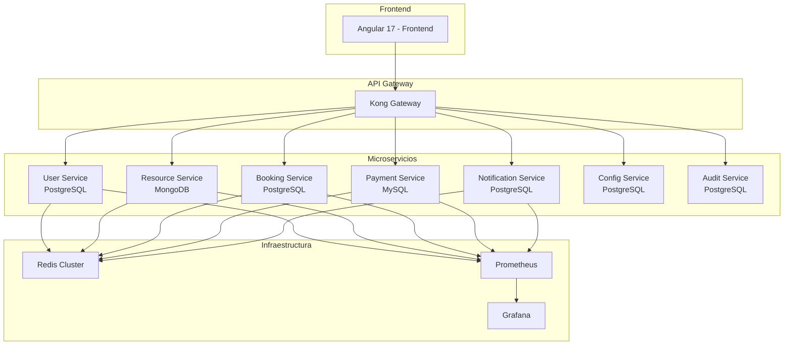
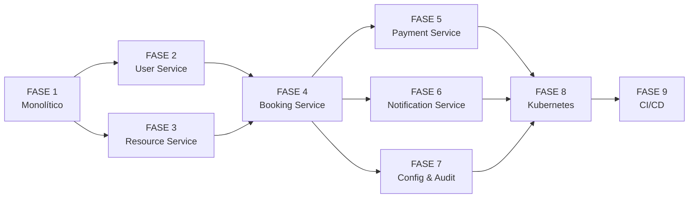

# Plan de Implementación - Sistema de Reservas de Salas de Reuniones

## 📋 Resumen Ejecutivo

Este plan detalla la implementación completa del sistema de reservas de salas de reuniones, pasando desde la estructura monolítica hasta una arquitectura de microservicios escalable. El proyecto incluye backend NestJS, frontend Angular, y una infraestructura robusta basada en Kubernetes.

---

## 🎯 Objetivos del Proyecto

### Objetivos Técnicos
- Implementar un sistema completo de gestión y reserva de salas de reuniones
- Desarrollar autenticación segura con JWT y roles de usuario
- Crear una arquitectura de microservicios escalable y mantenible
- Configurar infraestructura Kubernetes lista para producción
- Implementar monitoreo y observabilidad del sistema

### Objetivos de Negocio
- Permitir a usuarios registrar, ver y gestionar reservas de salas
- Proporcionar administración completa de usuarios, salas y reservas
- Ofrececer interfaz moderna y responsive con Angular Material
- Garantizar alta disponibilidad y rendimiento del sistema

---

## 🏗️ Arquitectura del Sistema



---

## 📦 Estructura de Microservicios

### Servicios Principales

| Servicio | Puerto | Base de Datos | Descripción |
|----------|--------|---------------|-------------|
| User Service | 3001 | PostgreSQL | Gestión de usuarios y autenticación |
| Resource Service | 3002 | MongoDB | Gestión de recursos y salas |
| Booking Service | 3003 | PostgreSQL | Sistema de reservas |
| Payment Service | 3004 | MySQL | Procesamiento de pagos |
| Notification Service | 3005 | PostgreSQL | Notificaciones y eventos |
| Config Service | 3006 | PostgreSQL | Configuraciones dinámicas |
| Audit Service | 3007 | PostgreSQL | Auditoría y logs |

---

## 📝 Plan de Implementación por Fases

### **FASE 1: Sistema Monolítico (Base)** 

#### 1.1 Backend NestJS - Módulos Core

##### Módulo de Autenticación
- Implementar registro de usuarios con validación de datos
- Implementar login con generación de JWT tokens
- Implementar protección de rutas con JWT Auth Guard
- Crear DTOs para login y registro
- Implementar hash de contraseñas con bcrypt

##### Módulo de Usuarios
- CRUD completo de usuarios
- Validación de email único
- Actualización de perfil de usuario
- Eliminación lógica de usuarios
- Búsqueda y filtrado de usuarios

##### Módulo de Salas
- CRUD completo de salas
- Atributos: nombre, capacidad, descripción, équipements, disponibilidad
- Búsqueda de salas por capacidad y características
- Gestión de estado de salas (disponible, mantenimiento, ocupada)

##### Módulo de Reservas
- CRUD completo de reservas
- Validación de disponibilidad de salas
- Gestión de horarios de reservas
- Cancelación de reservas
- Historial de reservas por usuario

#### 1.2 Frontend Angular - Componentes Core

##### Módulo de Autenticación
- Componente de login con validación Reactive Forms
- Componente de registro con validación
- Servicio de autenticación con gestión de tokens
- Guards para protección de rutas
- Interceptors para manejo de tokens

##### Módulo de Salas
- Listado de salas con filtros
- Visualización de detalles de sala
- Componente de disponibilidad de salas
- Búsqueda avanzada por características

##### Módulo de Reservas
- Formulario de creación de reservas
- Listado de reservas con filtros
- Calendario de reservas
- Gestión de reservas propias

##### Dashboard Principal
- Vista general de reservas del día
- Salas más utilizadas
- Estadísticas básicas
- Acciones rápidas

---

### **FASE 2: User Service - Microservicio de Usuarios**

#### 2.1 Estructura del Proyecto
```
services/user-service/
├── src/
│   ├── main.ts                      # Punto de entrada
│   ├── user-service.module.ts        # Módulo principal
│   ├── common/
│   │   ├── services/
│   │   │   ├── database-config.service.ts
│   │   │   ├── redis-config.service.ts
│   │   │   └── redis-event.service.ts
│   │   ├── decorators/
│   │   │   └── roles.decorator.ts
│   │   ├── guards/
│   │   │   ├── jwt-auth.guard.ts
│   │   │   └── roles.guard.ts
│   │   └── interceptors/
│   ├── entities/
│   │   ├── user.entity.ts
│   │   ├── role.entity.ts
│   │   └── session.entity.ts
│   └── modules/
│       ├── auth/
│       │   ├── auth.module.ts
│       │   ├── auth.controller.ts
│       │   ├── auth.service.ts
│       │   ├── jwt.strategy.ts
│       │   └── dto/
│       │       ├── login.dto.ts
│       │       └── register.dto.ts
│       ├── users/
│       │   ├── users.module.ts
│       │   ├── users.controller.ts
│       │   └── users.service.ts
│       └── roles/
│           ├── roles.module.ts
│           ├── roles.controller.ts
│           └── roles.service.ts
├── Dockerfile
├── docker-compose.yml
├── package.json
└── .env.example
```

#### 2.2 Entidades de Base de Datos

##### Entidad User
- Campos: id, email, username, password, firstName, lastName, phoneNumber, status, role, preferences, metadata, lastLoginAt, createdAt, updatedAt
- Enums: UserStatus (ACTIVE, INACTIVE, SUSPENDED, PENDING_VERIFICATION)

##### Entidad Role
- Campos: id, name, description, permissions, createdAt, updatedAt
- Roles predefinidos: ADMIN, MANAGER, USER, GUEST

##### Entidad Session
- Campos: id, userId, token, refreshToken, expiresAt, ipAddress, userAgent, createdAt

#### 2.3 Módulos de Negocio

##### AuthModule
- Registro de usuarios con validación de unicidad
- Login con verificación de credenciales
- Generación de JWT tokens (access y refresh)
- Renovación de tokens
- Recuperación de contraseña
- Verificación de email

##### UsersModule
- CRUD completo de usuarios
- Búsqueda por email, username
- Actualización de perfil
- Gestión de sesiones

##### RolesModule
- CRUD de roles
- Asignación de roles a usuarios
- Validación de permisos

---

### **FASE 3: Resource Service - Microservicio de Recursos**

#### 3.1 Estructura del Proyecto
```
services/resource-service/
├── src/
│   ├── main.ts
│   ├── resource-service.module.ts
│   ├── common/
│   │   └── services/
│   ├── entities/
│   │   ├── resource.entity.ts
│   │   ├── category.entity.ts
│   │   └── availability.entity.ts
│   ├── dto/
│   │   ├── create-resource.dto.ts
│   │   ├── update-resource.dto.ts
│   │   └── resource-filters.dto.ts
│   └── modules/
│       ├── resources/
│       │   ├── resources.module.ts
│       │   ├── resources.controller.ts
│       │   └── resources.service.ts
│       ├── categories/
│       │   ├── categories.module.ts
│       │   ├── categories.controller.ts
│       │   └── categories.service.ts
│       └── availability/
│           ├── availability.module.ts
│           ├── availability.controller.ts
│           └── availability.service.ts
├── Dockerfile
└── .env.example
```

#### 3.2 Entidades de Base de Datos (MongoDB)

##### Entidad Resource
- Campos: id, name, description, type, capacity, location, amenities, images, pricing, availabilitySchedule, status, metadata, createdAt, updatedAt
- Tipos: ROOM, DESK, MEETING_ROOM, CONFERENCE_ROOM, PRIVATE_OFFICE
- Amenities: WIFI, PROJECTOR, WHITEBOARD, VIDEO_CONFERENCE, PHONE, COFFEE, PARKING

##### Entidad Category
- Campos: id, name, description, parentId, hierarchyLevel, isActive, createdAt, updatedAt

##### Entidad Availability
- Campos: id, resourceId, date, startTime, endTime, isAvailable, bookings, createdAt, updatedAt

#### 3.3 Módulos de Negocio

##### ResourcesModule
- CRUD de recursos (salas, desks, oficinas)
- Búsqueda por nombre, tipo, capacidad
- Filtros avanzados por ubicación, amenities, precio
- Gestión de imágenes de recursos
- Políticas de disponibilidad

##### CategoriesModule
- CRUD de categorías jerárquicas
- Gestión de árbol de categorías
- Asignación de recursos a categorías

##### AvailabilityModule
- Consulta de disponibilidad en tiempo real
- Optimización de horarios
- Detección de conflictos de reservas
- Algoritmos de scheduling

---

### **FASE 4: Booking Service - Microservicio de Reservas**

#### 4.1 Estructura del Proyecto
```
services/booking-service/
├── src/
│   ├── main.ts
│   ├── booking-service.module.ts
│   ├── common/
│   │   └── services/
│   ├── entities/
│   │   ├── booking.entity.ts
│   │   └── booking-policy.entity.ts
│   ├── dto/
│   │   └── create-booking.dto.ts
│   └── modules/
│       ├── bookings/
│       │   ├── bookings.module.ts
│       │   ├── bookings.controller.ts
│       │   └── bookings.service.ts
│       ├── calendar/
│       │   ├── calendar.module.ts
│       │   ├── calendar.controller.ts
│       │   └── calendar.service.ts
│       └── policies/
│           ├── policies.module.ts
│           ├── policies.controller.ts
│           └── policies.service.ts
├── Dockerfile
└── .env.example
```

#### 4.2 Entidades de Base de Datos

##### Entidad Booking
- Campos: id, resourceId, userId, startTime, endTime, status, purpose, attendees, notes, totalPrice, paymentStatus, checkInTime, checkOutTime, createdAt, updatedAt
- Estados: PENDING, CONFIRMED, CANCELLED, COMPLETED, NO_SHOW

##### Entidad BookingPolicy
- Campos: id, name, description, minDuration, maxDuration, advanceBookingDays, cancellationDeadlineHours, pricingRules, capacityRules, isActive, createdAt, updatedAt

#### 4.3 Módulos de Negocio

##### BookingsModule
- Creación de reservas con validación de disponibilidad
- Actualización de reservas
- Cancelación de reservas con políticas
- Check-in y check-out automático
- Historial de reservas
- Notificaciones de cambio de estado

##### CalendarModule
- Vista de calendario de reservas
- Consultas por rango de fechas
- Filtrado por recurso, usuario, estado
- Exportación de calendarios

##### PoliciesModule
- CRUD de políticas de reserva
- Gestión de reglas de negocio
- Validación de reservas contra políticas
- Pricing dinámico

---

### **FASE 5: Payment Service - Microservicio de Pagos**

#### 5.1 Estructura del Proyecto
```
services/payment-service/
├── src/
│   ├── main.ts
│   ├── payment-service.module.ts
│   ├── common/
│   │   └── services/
│   ├── entities/
│   │   ├── payment.entity.ts
│   │   ├── invoice.entity.ts
│   │   └── subscription.entity.ts
│   └── modules/
│       ├── payments/
│       │   ├── payments.module.ts
│       │   ├── payments.controller.ts
│       │   └── payments.service.ts
│       ├── invoices/
│       │   ├── invoices.module.ts
│       │   ├── invoices.controller.ts
│       │   └── invoices.service.ts
│       └── subscriptions/
│           ├── subscriptions.module.ts
│           ├── subscriptions.controller.ts
│           └── subscriptions.service.ts
├── Dockerfile
└── .env.example
```

#### 5.2 Entidades de Base de Datos (MySQL)

##### Entidad Payment
- Campos: id, bookingId, userId, amount, currency, method, status, transactionId, stripePaymentIntentId, paypalOrderId, metadata, createdAt, updatedAt
- Métodos: CREDIT_CARD, DEBIT_CARD, BANK_TRANSFER, PAYPAL, STRIPE
- Estados: PENDING, PROCESSING, COMPLETED, FAILED, REFUNDED

##### Entidad Invoice
- Campos: id, paymentId, userId, bookingId, invoiceNumber, amount, tax, total, status, dueDate, paidAt, createdAt, updatedAt

##### Entidad Subscription
- Campos: id, userId, planId, status, startDate, endDate, nextBillingDate, stripeSubscriptionId, price, createdAt, updatedAt
- Planes: BASIC, PROFESSIONAL, ENTERPRISE

#### 5.3 Módulos de Negocio

##### PaymentsModule
- Procesamiento de pagos con Stripe
- Procesamiento de pagos con PayPal
- Gestión de refunds
- Webhooks para confirmación de pagos
- Historial de transacciones

##### InvoicesModule
- Generación automática de facturas
- Envío de facturas por email
- Gestión de cobros
- Reportes de facturación

##### SubscriptionsModule
- Gestión de suscripciones de usuarios
- Renovación automática de suscripciones
- Upgrade/downgrade de planes
- Gestión de métodos de pago

---

### **FASE 6: Notification Service - Microservicio de Notificaciones**

#### 6.1 Estructura del Proyecto
```
services/notification-service/
├── src/
│   ├── main.ts
│   ├── notification-service.module.ts
│   ├── common/
│   │   └── services/
│   ├── entities/
│   │   ├── notification.entity.ts
│   │   ├── message.entity.ts
│   │   └── event.entity.ts
│   └── modules/
│       ├── notifications/
│       │   ├── notifications.module.ts
│       │   ├── notifications.controller.ts
│       │   └── notifications.service.ts
│       ├── community/
│       │   ├── community.module.ts
│       │   ├── community.controller.ts
│       │   └── community.service.ts
│       └── events/
│           ├── events.module.ts
│           ├── events.controller.ts
│           └── events.service.ts
├── Dockerfile
└── .env.example
```

#### 6.2 Entidades de Base de Datos

##### Entidad Notification
- Campos: id, userId, type, title, body, channel, status, metadata, readAt, createdAt
- Tipos: BOOKING_CONFIRMED, BOOKING_CANCELLED, REMINDER, PAYMENT_RECEIVED, SYSTEM
- Canales: EMAIL, PUSH, SMS, IN_APP

##### Entidad Message
- Campos: id, senderId, recipientId, conversationId, body, attachments, readAt, createdAt

##### Entidad Event
- Campos: id, title, description, startDate, endDate, location, capacity, attendees, isPublic, createdAt, updatedAt

#### 6.3 Módulos de Negocio

##### NotificationsModule
- Envío de notificaciones multi-canal
- Plantillas de notificaciones
- Programación de recordatorios
- Notificaciones en tiempo real con WebSockets
- Preferencias de notificación por usuario

##### CommunityModule
- Sistema de mensajería entre usuarios
- Foros de discusión
- Gestión de eventos comunitarios
- Notificaciones de eventos

##### EventsModule
- CRUD de eventos
- Gestión de asistentes
- Confirmación de asistencia
- Recordatorios de eventos

---

### **FASE 7: Config Service y Audit Service**

#### 7.1 Config Service
- Gestión de configuraciones dinámicas
- Feature flags para funcionalidades
- Service discovery
- Configuración por entorno

#### 7.2 Audit Service
- Logging centralizado de todas las operaciones
- Auditoría de seguridad
- Cumplimiento normativo (GDPR)
- Reportes y dashboards de auditoría

---

### **FASE 8: Infraestructura Kubernetes**

#### 8.1 Archivos de Configuración

##### namespaces.yml
- Crear namespaces: coworking, coworking-staging, coworking-production

##### kong-gateway/
- kong-deployment.yml
- kong-service.yml
- kong-configmap.yml
- kong-secret.yml
- kong-declarative-config.yml

##### user-service/
- user-service-deployment.yml
- user-service-service.yml
- user-service-configmap.yml
- user-service-database.yml

##### resource-service/
- resource-service-deployment.yml
- resource-service-service.yml
- resource-service-configmap.yml
- resource-service-mongodb.yml

##### booking-service/
- booking-service-deployment.yml
- booking-service-service.yml
- booking-service-configmap.yml

##### payment-service/
- payment-service-deployment.yml
- payment-service-service.yml
- payment-service-configmap.yml
- payment-service-mysql.yml

##### notification-service/
- notification-service-deployment.yml
- notification-service-service.yml

##### redis-cluster.yml
- Configuración de Redis para caché y sesiones

##### monitoring.yml
- Prometheus
- Grafana
- Alertas

#### 8.2 Scripts de Despliegue

##### deploy.sh
- Funciones para deploy, status, logs, destroy
- Manejo de diferentes entornos

---

### **FASE 9: CI/CD Pipeline**

#### 9.1 GitHub Actions Workflow

##### stages/
- lint: Verificación de código
- test: Ejecución de tests unitarios
- build: Compilación de servicios
- security: Análisis de seguridad
- deploy-staging: Despliegue en staging
- test-e2e: Tests de integración
- deploy-production: Despliegue en producción

##### environments/
- staging: Variables de entorno para staging
- production: Variables de entorno para producción

---

## 🔧 Dependencias entre Fases



---

## 📊 Estimación de Effort por Fase

| Fase | Complejidad | Prioridad | Descripción |
|------|-------------|-----------|-------------|
| FASE 1 | Alta | Crítica | Base del sistema monolítico |
| FASE 2 | Media | Alta | Fundamento de autenticación |
| FASE 3 | Media | Alta | Gestión de recursos |
| FASE 4 | Alta | Crítica | Core del negocio |
| FASE 5 | Media | Media | Pagos y facturación |
| FASE 6 | Baja | Media | Notificaciones |
| FASE 7 | Baja | Baja | Configuración y auditoría |
| FASE 8 | Alta | Alta | Infraestructura |
| FASE 9 | Media | Media | Automatización |

---

## 🎯 Criterios de Éxito por Fase

### Fase 1: Sistema Monolítico
- [ ] API REST funcional con todos los endpoints
- [ ] Frontend con login, registro y CRUD de reservas
- [ ] Tests unitarios con cobertura > 70%
- [ ] Documentación de API con Swagger

### Fase 2-7: Microservicios
- [ ] Cada servicio independiente y desplegable
- [ ] Comunicación entre servicios documentada
- [ ] Tests de integración entre servicios
- [ ] Health checks funcionando

### Fase 8: Kubernetes
- [ ] Todos los servicios desplegados en cluster
- [ ] Kong Gateway configurado y funcionando
- [ ] Redis Cluster operativo
- [ ] Monitoreo con Prometheus y Grafana

### Fase 9: CI/CD
- [ ] Pipeline automatizado completo
- [ ] Despliegues sin downtime
- [ ] Rollback automático funcional
- [ ] Tests automatizados en pipeline

---

## 📚 Documentación Requerida

### Por Servicio
- README.md con descripción, instalación y uso
- API Documentation con Swagger/OpenAPI
- Deployment guide
- Architecture documentation
- Troubleshooting guide

### General
- Architecture overview
- Deployment guide
- Development setup
- Security considerations
- Scaling strategy

---

## 🚀 Próximos Pasos Inmediatos

1. **Iniciar con FASE 1** - Completar el sistema monolítico como base
2. **Configurar entorno de desarrollo** - Docker Compose para servicios
3. **Implementar tests unitarios** - Coverage > 70%
4. **Documentar API** - Swagger funcionando
5. **Preparar infraestructura** - Kubernetes cluster

---

## 📞 Soporte y Recursos

### Recursos Técnicos
- NestJS Documentation: https://docs.nestjs.com
- Angular Documentation: https://angular.io/docs
- TypeORM Documentation: https://typeorm.io
- Kubernetes Documentation: https://kubernetes.io/docs

### Herramientas Recomendadas
- Docker Desktop
- kubectl
- Lens (Kubernetes IDE)
- Postman/Insomnia
- pgAdmin (PostgreSQL)
- MongoDB Compass

---

**Plan creado:** Febrero 2025  
**Versión:** 1.0  
**Estado:** Listo para implementación
